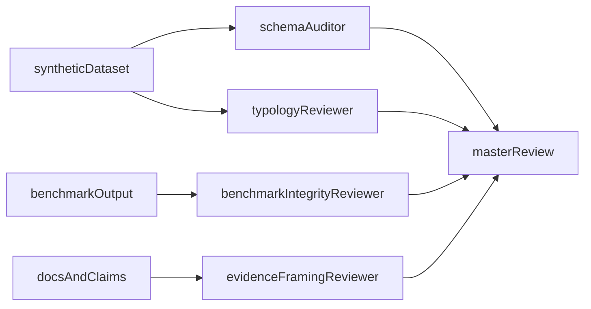

# RuleForge Synthetic Dataset Spec v1

**Evidence label:** `Synthetic-benchmark`

This document defines the canonical synthetic dataset standard for RuleForge benchmark work. Its purpose is to reduce ambiguity, control token spend, and ensure that future automation operates on governed, defensible data rather than ad hoc examples.

## Purpose

This spec exists to answer five practical questions:

1. What data shape is valid for RuleForge synthetic benchmark work?
2. Which behavioral typologies are in scope for the first version?
3. How are synthetic labels and assumptions generated?
4. How do sub-agents review dataset quality before higher-cost reasoning is used?
5. What public claims are allowed from this data?

The standard for v1 is not “perfect realism.” The standard is:

- internally consistent
- reproducible
- explainable
- safe to defend publicly

## Sub-Agent First Principle

Any recurring workflow using this dataset should follow a sub-agent-first pattern.

That means:

- narrow specialist review first
- synthesis second
- expensive reasoning only when contradictions or approval decisions exist

### Why

This keeps cron usage efficient and prevents expensive, vague full-repo reasoning on every run.

### Required review roles

Before the master agent treats a dataset or benchmark result as portfolio-grade, the following specialist checks should exist:

1. **Schema Auditor**
   - validates required fields, types, null handling, and row-level consistency
2. **Typology Consistency Reviewer**
   - checks whether each typology behaves according to its documented assumptions
3. **Benchmark Integrity Reviewer**
   - verifies that showcased claims match the actual benchmark artifact
4. **Evidence Framing Reviewer**
   - checks that docs and public-facing language do not exceed what the synthetic data supports

The master agent should only synthesize those outputs and make the final decision.

## Canonical Unit

The canonical v1 unit is a **synthetic transaction-monitoring alert row**.

One row represents a transaction-derived alert that can be evaluated by policy logic and benchmark scenarios.

## Canonical Schema

### Required fields

| Field | Type | Description |
|---|---|---|
| `alert_id` | string | Unique synthetic alert identifier |
| `entity_id` | string | Synthetic customer, wallet, or monitored entity identifier |
| `timestamp` | string (ISO 8601) | Event or alert time |
| `typology` | string | Behavioral category assigned by scenario assumptions |
| `rule_id` | string | Rule or rule-family identifier |
| `amount_usd` | number | Transaction or alert amount in USD |
| `direction` | string | `inbound` or `outbound` |
| `hop_distance` | integer | Distance from flagged exposure source (`0` = direct) |
| `risk_score_raw` | number | Synthetic raw risk score before decay or normalization |
| `threshold_value` | number | Baseline benchmark threshold for the alert |
| `filed_sar` | boolean | Synthetic suspicious-activity outcome proxy |
| `days_to_disposition` | number | Synthetic investigation-speed proxy |

### Recommended fields

| Field | Type | Description |
|---|---|---|
| `is_true_positive` | boolean | Optional synthetic quality label |
| `counterparty_id` | string | Synthetic counterparty or cluster ID |
| `counterparty_cluster` | string | Synthetic grouping for entropy or fan-out tests |
| `window_id` | string | Time-window key used for velocity or burst scoring |
| `notes` | string | Optional synthetic explanation for audit/debug use |

### Compatibility note

The current `tm-alert-simulator` shape remains compatible with this spec, but v1 RuleForge work should prefer the canonical names above when generating new golden datasets.

## In-Scope Typologies (v1)

The first version should stay intentionally small.

### 1. `structuring_pattern`

Definition:

- repeated values clustering near an anchor threshold
- lower individual amounts
- suspiciousness emerges from repetition and boundary behavior

Primary signals:

- threshold-proximity ratio
- repeated event count
- modest to medium raw risk score

### 2. `rapid_in_out`

Definition:

- unusually tight inflow/outflow sequences over short windows
- behavior suggests pass-through or mule-style activity

Primary signals:

- velocity spike
- burstiness
- short disposition windows on high-score examples

### 3. `mixer_indirect`

Definition:

- indirect exposure scenarios where risk decays by hop distance
- suspiciousness depends on path distance and retained score after decay

Primary signals:

- hop distance
- risk score normalization
- indirect exposure severity tradeoffs

### 4. `high_risk_jurisdiction`

Definition:

- jurisdiction-linked exposure with elevated baseline risk
- often moderate signal quality with strong operational relevance

Primary signals:

- medium-to-high raw score
- moderate recall importance
- value sensitivity

### 5. `sanctions_exposure`

Definition:

- direct or near-direct exposure to flagged entities
- highest baseline severity and strongest escalation posture

Primary signals:

- high raw score
- low hop distance
- strong direct-exposure weighting

## Label Generation Assumptions

All labels are synthetic and must be described as such.

### Base rules

1. Higher `risk_score_raw` should generally increase `filed_sar` likelihood.
2. Lower `hop_distance` should increase retained exposure severity.
3. `sanctions_exposure` should have the strongest baseline escalation bias.
4. `structuring_pattern` should cluster values around anchor thresholds.
5. `rapid_in_out` should show stronger burstiness than background activity.

### Example probability logic

Illustrative synthetic outcome model:

```text
P(filed_sar) = base_typology_bias
             + score_bias(risk_score_raw)
             + exposure_bias(hop_distance)
             + optional_behavior_bias
```

This should be implemented transparently and versioned with the dataset generator, not hidden behind opaque logic.

## Mathematical Signals Allowed In v1

These signals are allowed because they are explainable and compatible with public synthetic data.

### Velocity z-score

```text
Z_velocity = (current_window_count - rolling_mean_count) / (rolling_std_count + epsilon)
```

Use:

- rapid activity spikes
- sudden queue pressure

### Threshold-proximity ratio

```text
P_delta = count(|amount_usd - threshold_anchor| <= delta) / total_tx
```

Use:

- structuring behavior
- near-threshold repetition

### Counterparty entropy

```text
H = -sum(p_i * log(p_i))
Delta_H = H_current - H_baseline
```

Use:

- sudden concentration
- fan-out or funnel shifts

### Burstiness index

```text
B = (sigma(inter_arrival_times) - mean(inter_arrival_times)) /
    (sigma(inter_arrival_times) + mean(inter_arrival_times) + epsilon)
```

Use:

- clustered transaction timing
- mule or rapid in/out pressure

### Hop-decay normalization

```text
normalised_score = risk_score_raw * hop_weight(hop_distance)
```

Use:

- indirect exposure handling
- RuleForge alignment

## Fractal-Inspired Research Layer

Mandelbrot-style thinking is allowed only as an **experimental framing** for irregularity features.

Approved framing:

- fractal-inspired irregularity signals
- self-similarity and persistence proxies
- scale-sensitive burst patterns

Not approved:

- claims that Mandelbrot-set methods directly prove fraud
- language suggesting mathematical inevitability of criminal behavior

### Acceptable experimental persistence proxy

```text
H_hat > 0.5
```

Where `H_hat` is a Hurst-like persistence estimate over timing or amount sequences.

This is permitted as a research feature only, not a production-grade detection claim.

## Golden Dataset Standard

Every showcase-worthy benchmark should have a canonical dataset reference with:

- fixed seed
- fixed generator version
- fixed scenario/config reference
- stable field names
- explicit evidence label

### Required metadata block

```json
{
  "label": "Synthetic-benchmark",
  "seed": 42,
  "generator_version": "v1",
  "dataset_spec": "RuleForge Synthetic Dataset Spec v1",
  "scenario_profile": "standard",
  "generated_at": "ISO-8601"
}
```

## Review Flow



### Promotion rule

A dataset is “portfolio-ready” only if:

1. schema audit passes
2. typology assumptions are consistent
3. benchmark artifact matches showcased narrative
4. evidence wording remains within allowed framing

## Allowed Public Claims

Allowed:

- “Synthetic benchmark dataset”
- “Directional proxy metrics”
- “Controlled policy comparison”
- “Simulation-first evaluation”
- “Fractal-inspired irregularity features under experimental conditions”

Not allowed:

- “This dataset proves real-world fraud detection accuracy”
- “This data reflects real user populations”
- “These formulas detect criminals”
- “Mandelbrot mathematics proves laundering behavior”

## Obsidian Integration

The dataset should be documented in Obsidian as a knowledge object, not just a file artifact.

Recommended note sections:

- dataset purpose
- schema version
- typology assumptions
- signal formulas
- benchmark runs using this dataset
- safe claims
- rejected claims

This allows the agent to reason from stable institutional memory instead of recreating assumptions each session.

## Default Working Recommendation

Start with one small canonical dataset and keep it stable.

Recommended v1:

- 1 seed
- 1 standard scenario profile
- 5 typologies
- 1 benchmark scenario pack
- 1 recruiter-safe case study

Complexity should be added only after the review flow is stable.

## What This Spec Proves

This spec does not prove fraud detection.

It proves that RuleForge-style thinking can be expressed as:

- clear schema design
- explicit behavioral assumptions
- explainable mathematical signals
- governed benchmark workflows
- human-reviewed evidence framing

That is enough for a serious mock project.
